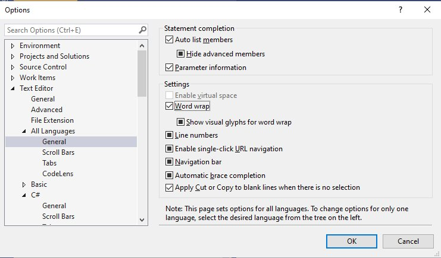

<!-- this is very Windows-y... can we do Your first program on Windows/mac/Linux or generify expressions such as "solution explorer" or make an OS-specific version of this lab? It should not generally be a problem with the later labs. -->

# Your First Program

## Opening Your First Program

#. Download Welcome.zip from the same place where you downloaded this instructions file and save it on your computer.
#. Extract (Right-click on the file, then click on "Extract all") this archive. **Do not simply double-click on it, as that would only give you a preview of the archive without actually extracting it.**
#. Go in the "Welcome" folder that was created.
#. Double click on the "Welcome.sln" file.
#. If you are prompted with a screen like this one:

    { width=80% }

    Pick "Visual Studio 2019" (and **not** Visual Studio Code or Blend for Visual Studio).

#. Visual Studio (VS) should start. You don't have to register to the "Visual Studio Team Services Organizations" (but you can, using your @augusta.edu account, if you want), discard the security warning if there is one.
#. In the "Solution Explorer" to the right, expand all the items that can be expanded by clicking on the ▷ (right-triangle) symbol.

## Compiling and Executing Your First Program

#. In the Solution Explorer, double-click on `Program.cs`. This is the *source code* of the application you are actually considering.
#. Let's compile this program, by clicking `Build` → `Build solution`. What happened?
#. Let's run this program, by clicking `Debug` → `Start without Debugging`. What happened?

You will **extensively** compile and run programs in this class.
Instead of having to click twice, I highly recommend that you start now memorizing shortcuts:

- Use <kbd>Ctrl</kbd> + <kbd>Shift</kbd> + <kbd>B</kbd> to build the solution.
- Use <kbd>Ctrl</kbd> + <kbd>F5</kbd> to start the program without debugging.

With <kbd>Alt</kbd> + <kbd>F4</kbd> (to exit any program), that makes 3 shortcuts already!
You can find a complete list at <http://visualstudioshortcuts.com/> and on [this page](https://docs.microsoft.com/en-us/visualstudio/ide/default-keyboard-shortcuts-in-visual-studio?view=vs-2019) of the Microsoft docs.
I will try to introduce more useful shortcuts as we progress.

<!-- need to EDIT -->

## Configuring Visual Studio 

Now that you have practiced starting and using Visual Studio, there are a few changes you should make to ensure your installation is set up in an easy-to-use way:

#. Make Windows Explorer show file extensions. Follow the instructions described [in Microsoft's help forum](https://answers.microsoft.com/en-us/windows/forum/all/in-win10-how-to-show-the-file-extension-for/ed21ff20-cdb3-4263-9c7d-fc6ed125fc82), [on this website](http://kb.winzip.com/kb/entry/26/), or consult the textbook's "Before You Begin" chapter.
#. In Visual Studio, make sure the line numbers are shown: Go to "Tools" → "Options" → "Text Editor" → "All Languages" →  "General" → "Line Numbers" (VS 15.5.2), or "Text Editor" → "Options" → "All languages" → "Line Numbers" (newer versions).
#. Activate word-wrap in VS.
    Refer to [this page](https://msdn.microsoft.com/en-us/library/ms165339.aspx) for VS 2015, or [this page](https://docs.microsoft.com/en-us/visualstudio/ide/reference/how-to-manage-word-wrap-in-the-editor) for VS 2017 and 2019).
The item to be clicked should look like this:

    { width=80% }

    If you were successful, you should go from 

    { width=40% }

    to 

    { width=40% }

    See the difference?
    Once word-wrap is enabled, the horizontal scrolling will disappear, and every line that is too long is "wrapped"; this is indicated with the  sign.

# Backups

Now we need to make sure you know how to save your work and access it.
This is especially important if you are using the computer lab rooms, as **you can not store files permanently on the lab's computer, you will have to store them either online in your cloud storage or on a USB drive**.

## Finding The Right Tool

You can save your project:

- On your hard drive, if you are using your own computer.
- On an external/removable data storage: USB flash drive, external hard disk drive, or any kind of USB mass storage device.
- On a server: the University has a [partnership](https://www.augusta.edu/its/box/) with [box.com](https://box.com/), and you can follow [this tutorial](https://www.augusta.edu/its/box/quickstart.php) to get started, but any service ([Google Drive](https://www.google.com/drive/), [Dropbox](https://www.dropbox.com/), [OneDrive](https://onedrive.live.com/), etc.) would do.

Having _two_ backups is generally recommended.

If you chose the "virtual" option (i.e., using a server) and you are in a computer lab, **do not** try to install a synchronization program (like [Google Drive and Sync](https://www.google.com/drive/download/), [Box's app](https://app.box.com/services/browse/official), etc.) on the lab computer: it will likely not work, due to [University rules](https://augusta.policytech.com/dotNet/documents/?docid=5702).
Instead, create the structure/project/files on the computer during the lab and upload them (using the web-interface) at the end of the lab.
Make sure to always upload your files before logging out of the computer.

## Making Sure You Have the Right Files

Now that you know where to store your files, create a folder for this class, and a subfolder for the first lab.
Put all of the files related to the "Welcome" solution in this folder.
You organization should look like the following:


<!--

```
└───csci1301
    ├── 01_lab
    ├── 02_lab
    │   └── Welcome1.zip
    ├── 03_lab
    └── txtbook_source
        └── examples.zip
```

Extract the archives `examples.zip` and `Welcome1.zip` in their respective folder and suppress them.
-->


```
└───csci1301
    └── 01_lab
        ├── Welcome.zip
        └── Welcome
            ├── Welcome.sln
            └── Welcome
                ├── Welcome.csproj
                ├── Properties
                │   └── AssemblyInfo.cs
                ├── Program.cs
                ├── obj
                │   └── Debug
                │       ├── Welcome.pdb
                │       ├── Welcome.exe
                │       ├── Welcome.csprojResolveAssemblyReference.cache
                │       ├── Welcome.csproj.FileListAbsolute.txt
                │       ├── TempPE
                │       ├── TemporaryGeneratedFile_E7A71F73-0F8D-4B9B-B56E-8E70B10BC5D3.cs
                │       ├── TemporaryGeneratedFile_5937a670-0e60-4077-877b-f7221da3dda1.cs
                │       ├── TemporaryGeneratedFile_036C0B5B-1481-4323-8D20-8F5ADCB23D92.cs
                │       └── DesignTimeResolveAssemblyReferencesInput.cache
                ├── bin
                │   └── Debug
                │       ├── Welcome.vshost.exe.manifest
                │       ├── Welcome.vshost.exe.config
                │       ├── Welcome.vshost.exe
                │       ├── Welcome.pdb
                │       ├── Welcome.exe.config
                │       └── Welcome.exe
                └── App.config
```

where `csci1301` and `01_lab` are folders, and ` Welcome.zip` is a file.

You do not need to check that every single file and folder is here, just note that you have multiple folders, and that there are many files in the `Welcome` folder, not only the `.sln` and the `.cs`: make sure you copy the entire structure when you want to backup or share (i.e. turn in) your program!
In this case, copying the `Welcome` folder is enough.

## How Was the Backup?

Once you are done, test that you performed the backup properly.
Re-download or transfer the files you just saved (the whole `Welcome` folder) on the computer and make sure you can still open the project with Visual Studio (VS).
Do you remember how to build the solution and start the program without debugging?
Using the shortcuts?
If not, go have another look back at the "Compiling and Executing Your First Program" section.

If your backup went wrong (you can't open the project, it won't compile, …), try to understand what happened.
Then, re-download the "Welcome" archive (Welcome.zip), extract it, and make sure you can build the solution and start the program without debugging.

# Orientation

Have a look at the following screenshot:

{width=100%}

You should have roughly the same on your computer.
If this image appears too small, you can zoom to have a clearer look.

Answer the following:

#. Where is the file explorer?
#. How many folders are in the folder opened in the file explorer?
#. How many files are in the folder opened in the file explorer?
#. Where is Visual Studio (VS)?
#. Where is the solution explorer?
#. Where is the window where you can edit the source code?
#. What is the output of the program you just built?

<!--
# Re-using and Editing

Close Visual Studio (VS).
With the file explorer, create a new folder (call it for instance `02_lab`) and copy the `Welcome` folder in it.
In this exercise, you will rename and edit this copy.

## Renaming

Open with VS the copy of the `Welcome` folder that you just created.
Rename the solution **within** VS:

#. Right-click on "Solution 'Welcome' (1 project)", select "Rename", rename it to "MyFirstProgram".
#. What change(s) do you notice in Visual Studio?
#. Can you still build and debug your program?
#. Look in the file explorer: did the name of the folder changed? Did the name of the `.sln` file changed?

**You should _not_ rename a solution with the file explorer: _always_ use VS to rename.**

## Editing

We will now change (edit) our "MyFirstProgram" solution.

#. In `program.cs`, replace `"Welcome to the lab portion of CSCI 1301!"` with `"This is my first program."`.
#. Build the solution and start the program without debugging. Do you notice any change?
#. Insert a new line after `// This is an in-line comment. ` and before the first `}` sign, and paste the following:

    ~~~~~~~{.cs}
    Console.Write("This is my second message."); 
    ~~~~~~~
#. Build the solution and start the program without debugging. Do you notice any change?
#. Insert another new line after the one you just created, and paste the following: 

    ~~~~~~~{.cs}
    Console.WriteLine("This is my third message."); 
    ~~~~~~~
#. Build the solution and start the program without debugging. Can you notice the difference between `WriteLine` and `Write`?
#. Insert another new line after the one you just created, and paste the following: 

    ~~~~~~~{.cs}
    Console.Write("\t This is my fourth message."); 
    ~~~~~~~
#. Build the solution and start the program without debugging. Can you tell what `\t` is doing?
#. Insert another new line after the one you just created, and paste the following: 

    ~~~~~~~{.cs}
    Console.Write("\n This \n is \n my fifth message.\n");
    ~~~~~~~
#. Build the solution and start the program without debugging. Can you tell what `\n` is doing?
#. Have a look at [the documentation page of microsoft on escape sequences](https://docs.microsoft.com/en-us/cpp/c-language/escape-sequences), and edit your program by adding a statement that displays the `\` and the `"` characters.
#. Add a comment (using `//` or `/*` and `*/`) in your program.

Make a backup of what you just did: upload the `02_lab` folder you created previously on your remote backup, or copy it on your thumb drive.
**Do not** use the "Save as…" capacities of VS: close VS and copy/upload the folder "by hand", using the file explorer or a browser.
Re-downloading or re-transfering it and re-opening it is a good way of making sure that your back up was correct.
-->

# Breaking Your Program

If you followed the instructions carefully, your were able to build the solution and start the program without debugging after each step.
As you know, C\# has precise rules and not respecting them can prevent your solution from being built by VS.

In this exercise, you are asked to do the following:

#. Change the program so that it violates one of the syntax rules of `C#`.
#. Build the solution and note that an error is reported. In the build output (cf. the screenshot presented earlier, you may need to click "View" → "Output" or switch tabs in VS to see it), you will see a message like 

        ========== Build: 0 succeeded, 1 failed, 0 up-to-date, 0 skipped ==========

#. Click on the "Error list" tab next to the build output, and make sure you understand the error message.
#. Undo your change, using <kbd>Ctrl</kbd> + <kbd>z</kbd>.
#. Make sure you can build the solution without a new error message.

Do it three times, in order to identify three different error messages, and three ways of breaking C\#'s rules.

If you have time or need ideas, you can try with the following, and see which one(s) make the building impossible (do not forget to undo your change after):

- Remove the semicolon after `using System`
- Replace `class Welcome` with `class TestOne` 
- Remove the brace (or "curly bracket", i.e., the `}` symbol) at the last line.
- Add three new lines at the end of the file
- Replace `Console.WriteLine` with `CONSOLE.WriteLine`
- Replace `Console.WriteLine` with `Console.WRITELINE`
- Add a new line between `Console.` and `WriteLine`
- Add a new line between `WriteLine` and `(`
- Add a new line between `Write` and `Line`
- Replace  `Main()` with `Method()`
- Remove the indentation (i.e., the space between the beginning of the line and the first character of the instruction) on all lines
